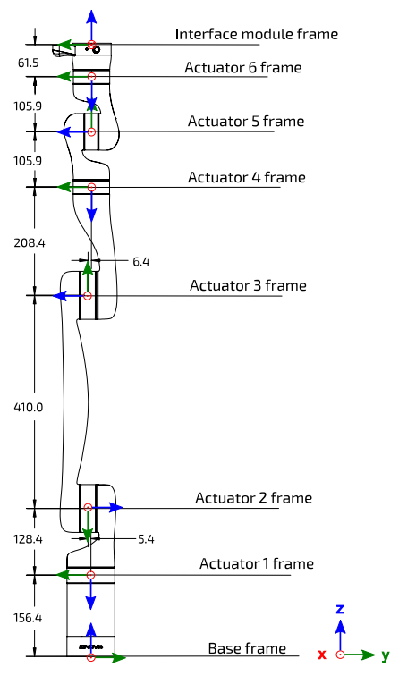
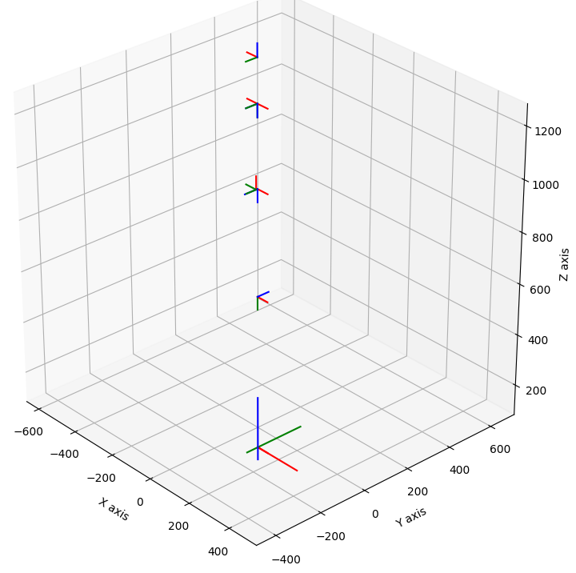
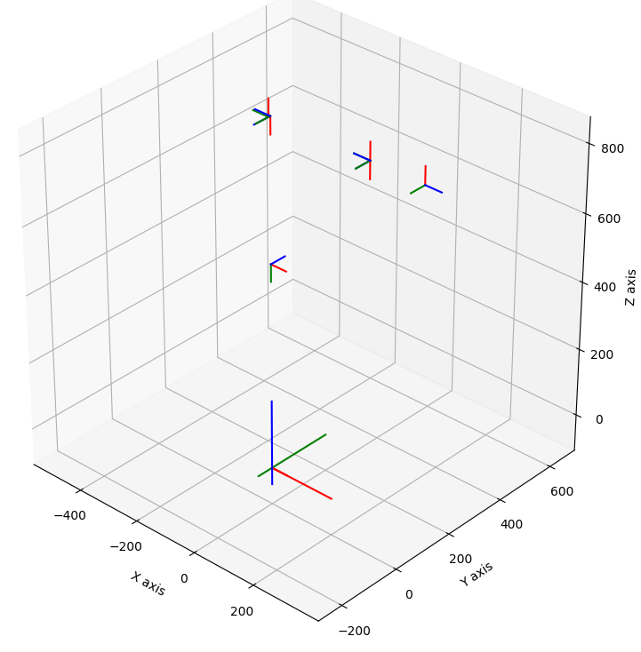
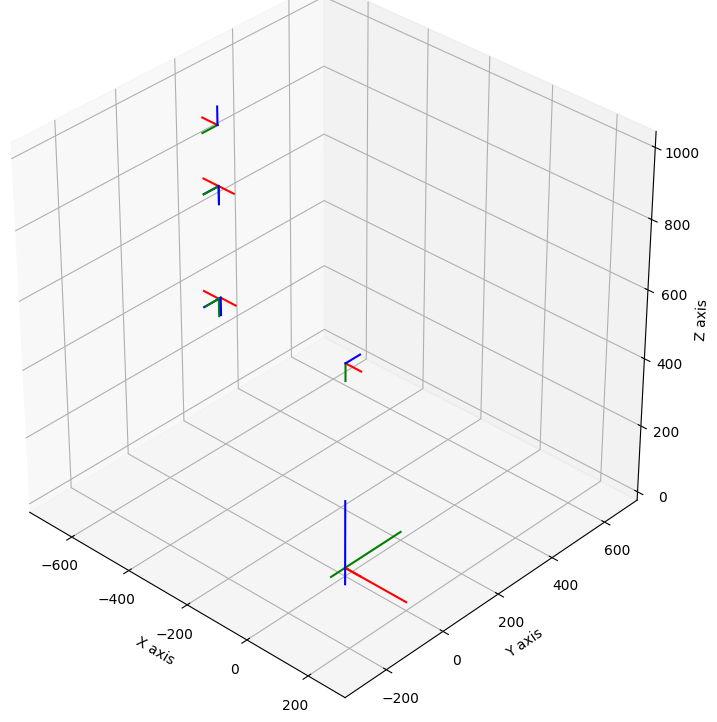
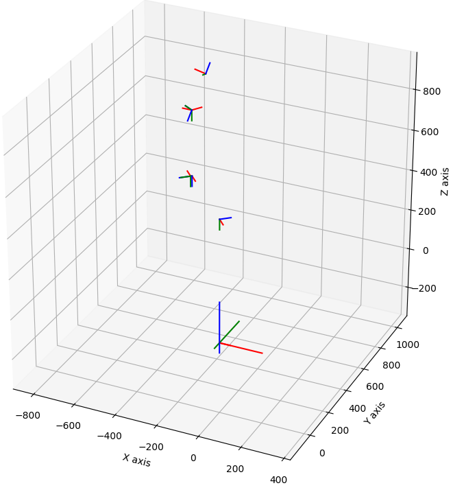

# Manipulator Frame Visualisation through Forward Kinematics using Python

Visualisation of frames for a manipulator Based-upon a Kinova Gen-3 arm with 6-DoF.

## Table of Contents

- [Requirements](#requirements)
- [Code Output](#code-output)
    - [Home Pose](#home-pose)
    - [Pose A](#pose-a)
    - [Pose B](#pose-b)
    - [Random Pose](#random-pose)

## Requirements

- Python
- Numpy
- Matplotlib

## Code Output

### Home Pose

$\theta_{1}$ = 0;
$\theta_{2}$ = 0;
$\theta_{3}$ = 0;
$\theta_{4}$ = 0;
$\theta_{5}$ = 0;
$\theta_{6}$ = 0;

### Pose A

$\theta_{1}$ = 0;
$\theta_{2}$ = 0;
$\theta_{3}$ = -90;
$\theta_{4}$ = 0;
$\theta_{5}$ = 0;
$\theta_{6}$ = 0;

### Pose B

$\theta_{1}$ = 0;
$\theta_{2}$ = -90;
$\theta_{3}$ = -90;
$\theta_{4}$ = 0;
$\theta_{5}$ = 0;
$\theta_{6}$ = 0;

### Random Pose

$\theta_{1}$ = 48;
$\theta_{2}$ = -90;
$\theta_{3}$ = -90;
$\theta_{4}$ = 74;
$\theta_{5}$ = 25;
$\theta_{6}$ = 230;

